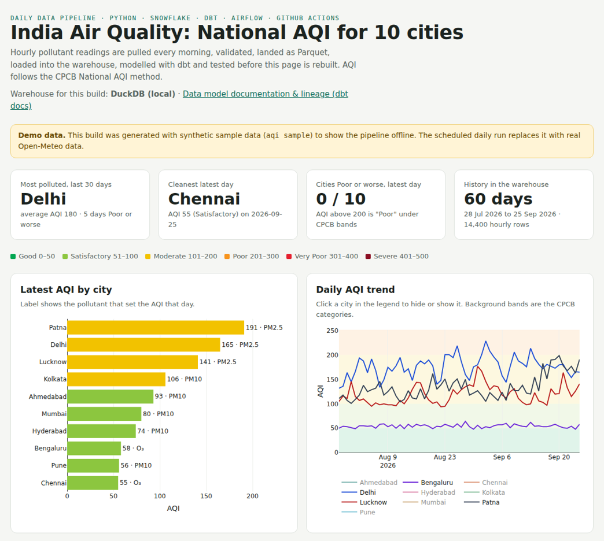
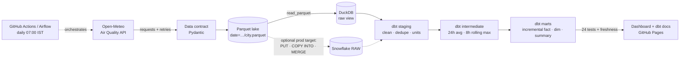
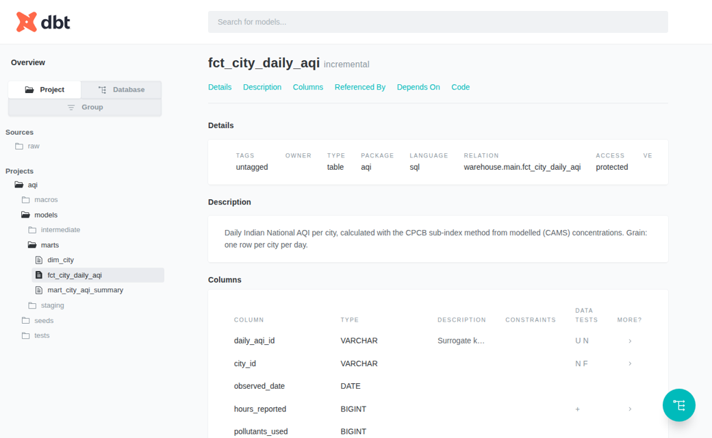

# India Air Quality Pipeline · dbt + DuckDB (Snowflake-ready)

**Live dashboard → https://amannnn7.github.io/india-air-quality-pipeline/** · **[dbt docs & lineage](https://amannnn7.github.io/india-air-quality-pipeline/dbt-docs/)**

A production-style ELT pipeline that calculates the daily **Indian National AQI** (CPCB method) for 10 cities.
Every morning it pulls hourly pollution readings from a public API, validates them against a data contract,
lands them as Parquet, transforms them with an **incremental dbt** star schema, runs **29 data tests**, flags sudden level shifts in the data,
publishes **dbt docs**, and rebuilds a dashboard.

It runs daily on **DuckDB**. The same dbt models also have a **Snowflake** production target
(`PUT → COPY INTO → MERGE` loader, key-pair auth, setup SQL); that path is tested in CI against a
Snowflake emulator but has not been run on a live Snowflake account. Switching is one setting (`AQI_TARGET`).
Orchestrated by **GitHub Actions** (an equivalent **Airflow** DAG is included), packaged with **Docker**.



## Architecture



## Skills this project demonstrates

| Area | Where |
|---|---|
| **Snowflake (prod target, emulator-tested)**: loader with internal stage, `PUT`, `COPY INTO` Parquet, `MERGE` upserts; setup SQL with RBAC, key-pair service user, resource monitor, auto-suspend warehouse | `src/aqi_pipeline/snowflake_load.py`, `snowflake/setup.sql` |
| **DuckDB (current warehouse)**: same dbt models via a dev/prod target switch, Parquet read directly | `dbt/profiles.yml`, `dbt/macros/` |
| **dbt**: staging/intermediate/marts, star schema, **incremental** model with lookback, seeds, macros with adapter **dispatch**, generic + singular tests, source freshness, docs & lineage | `dbt/` |
| **Advanced SQL**: window functions (`row_number`, `lag`, rolling averages, `rank`), `QUALIFY`, time-based self-join, `MAX_BY`, `MODE` | `dbt/models/` |
| **Python engineering**: packaging, CLI, type hints, retries with back-off, Pydantic data contracts, PyArrow | `src/aqi_pipeline/` |
| **Data lake basics**: Hive-partitioned Parquet, idempotent overwrite, atomic writes | `src/aqi_pipeline/load.py` |
| **Orchestration**: GitHub Actions schedule, Apache Airflow 3 DAG with retries | `.github/workflows/daily.yml`, `orchestration/airflow_dag.py` |
| **Testing & CI/CD**: 24 pytest tests (unit, end-to-end, incremental-vs-full-refresh, Snowflake emulator), ruff, Docker build in CI | `tests/`, `.github/workflows/ci.yml` |
| **Containers**: Dockerfile, non-root user, env-file secrets | `Dockerfile` |
| **Security & cost**: no passwords (RSA keys), secrets in GitHub Secrets, least-privilege role, 5-credit monthly cap | `snowflake/setup.sql` |

## Data model

| Model | Type | Grain | Purpose |
|---|---|---|---|
| `stg_air_quality__hourly` | view | city × hour | Cleaned, de-duplicated readings; CO converted to mg/m³ |
| `int_pollutant_daily` | view | city × day | 24-hour averages, highest 8-hour rolling average, hours of coverage |
| `fct_city_daily_aqi` | **incremental** | city × day | Sub-index per pollutant, AQI, category, dominant pollutant, trends |
| `dim_city` | table | city | City, state, region, coordinates |
| `mart_city_aqi_summary` | table | city | Last 30 days: average, worst, days by category, rank |



## Run it

```bash
python -m venv .venv
.venv\Scripts\activate           # Windows   (macOS/Linux: source .venv/bin/activate)
pip install -e ".[dev]"

aqi sample --days 60              # offline demo on DuckDB, no accounts needed -> site/index.html
pytest                            # 21 tests

# Real run on Snowflake (after snowflake/setup.sql, see docs/GUIDE.md section 8)
$env:AQI_TARGET = "snowflake"      # PowerShell; plus SNOWFLAKE_ACCOUNT / _USER / _PRIVATE_KEY_PATH
aqi backfill --start 2026-07-01 --end 2026-09-25
aqi run                           # the daily job

docker build -t aqi-pipeline . && docker run --rm aqi-pipeline sample --days 15
```

`AQI_TARGET=duckdb` (the default) runs the identical dbt models on a local DuckDB file. It's used for
development and CI so tests never need cloud credentials, and as a fallback warehouse.

## Data-quality monitoring

`mart_aqi_level_shifts` flags dates where a city's 14-day average AQI jumps by 50+ points **and** by more than
twice its normal day-to-day spread, then stays there. Real air rarely does that overnight; when several cities
shift on the same date, the cause is almost always upstream (e.g. a model update at the data provider).
The dashboard lists these flags and says which look like data-source changes.

## Honest limitations

* Values come from the **CAMS global model** (~45 km grid) via Open-Meteo, not CPCB ground stations, so they will
  not match the official CPCB bulletin exactly.
* NH₃ and lead are not available from the source and are not used.
* CPCB defines no upper concentration for "Severe"; conventional caps are used and AQI is capped at 500.

**[docs/GUIDE.md](docs/GUIDE.md)** explains every step, every file and every tool in plain language, with
interview questions and answers.

Data: [Open-Meteo](https://open-meteo.com/) (CC BY 4.0) · Copernicus Atmosphere Monitoring Service.
